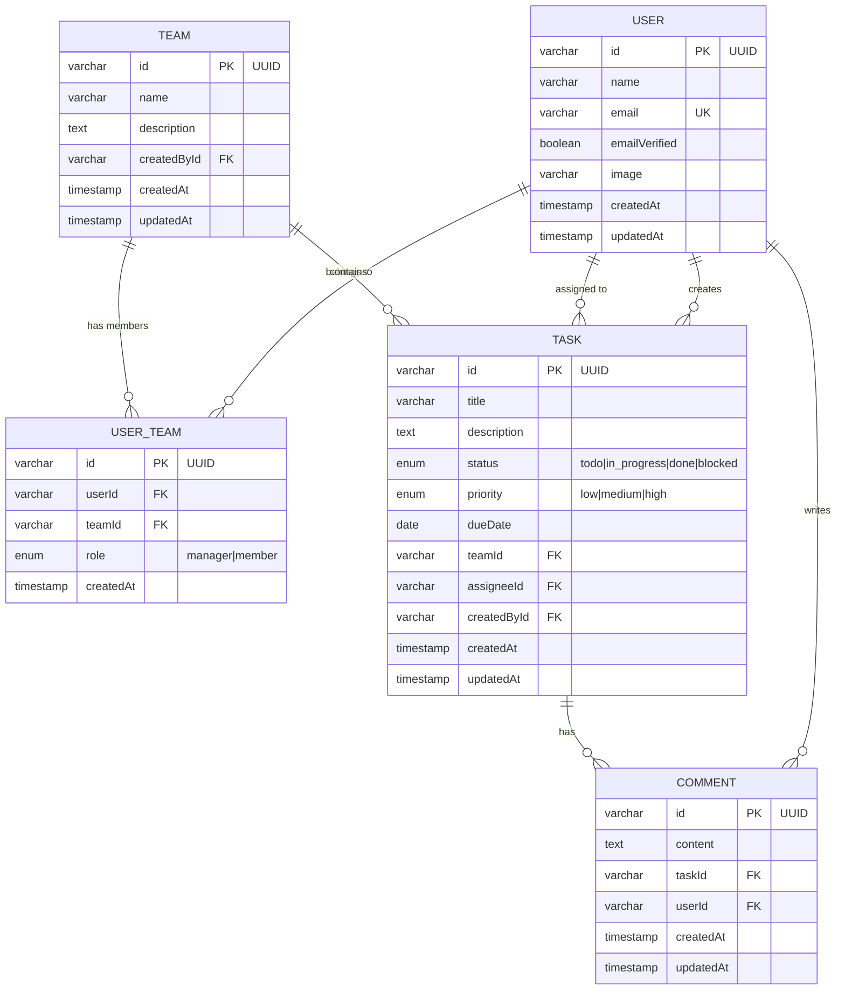

# Data Models - ManagerCheck

**Generated:** 2025-12-24
**ORM:** Drizzle ORM
**Database:** MySQL

---

## Schema Overview



---

## Table Definitions

### user (better-auth managed)

Authentication table managed by better-auth. Contains user profile data.

| Column | Type | Constraints | Description |
|--------|------|-------------|-------------|
| id | varchar(36) | PK | UUID identifier |
| name | varchar(255) | - | Display name |
| email | varchar(255) | UNIQUE | User email |
| emailVerified | boolean | default false | Email verification status |
| image | varchar(255) | nullable | Profile image URL |
| createdAt | timestamp | default NOW | Creation timestamp |
| updatedAt | timestamp | auto-update | Last update timestamp |

### team

Teams group users together for task management.

| Column | Type | Constraints | Description |
|--------|------|-------------|-------------|
| id | varchar(36) | PK | UUID identifier |
| name | varchar(255) | NOT NULL | Team name |
| description | text | nullable | Team description |
| createdById | varchar(36) | FK → user.id | Creator (first manager) |
| createdAt | timestamp | default NOW | Creation timestamp |
| updatedAt | timestamp | auto-update | Last update timestamp |

**Indexes:**
- `team_createdById_idx` on createdById

### user_team (Junction Table)

Many-to-many relationship between users and teams with role designation.

| Column | Type | Constraints | Description |
|--------|------|-------------|-------------|
| id | varchar(36) | PK | UUID identifier |
| userId | varchar(36) | FK → user.id | Team member |
| teamId | varchar(36) | FK → team.id | Team |
| role | enum | 'manager' \| 'member' | User's role in team |
| createdAt | timestamp | default NOW | Join date |

**Indexes:**
- `userTeam_userId_idx` on userId
- `userTeam_teamId_idx` on teamId
- Unique constraint on (userId, teamId)

**On Delete:**
- userId → CASCADE
- teamId → CASCADE

### task

Tasks belong to teams and can be assigned to team members.

| Column | Type | Constraints | Description |
|--------|------|-------------|-------------|
| id | varchar(36) | PK | UUID identifier |
| title | varchar(255) | NOT NULL | Task title |
| description | text | nullable | Detailed description |
| status | enum | default 'todo' | todo \| in_progress \| done \| blocked |
| priority | enum | default 'medium' | low \| medium \| high |
| dueDate | date | nullable | Due date |
| teamId | varchar(36) | FK → team.id, NOT NULL | Owning team |
| assigneeId | varchar(36) | FK → user.id, nullable | Assigned user |
| createdById | varchar(36) | FK → user.id, NOT NULL | Task creator |
| createdAt | timestamp | default NOW | Creation timestamp |
| updatedAt | timestamp | auto-update | Last update timestamp |

**Indexes:**
- `task_teamId_idx` on teamId
- `task_assigneeId_idx` on assigneeId
- `task_createdById_idx` on createdById
- `task_status_idx` on status
- `task_teamId_status_idx` on (teamId, status) - Composite

**On Delete:**
- teamId → CASCADE (delete team deletes tasks)
- assigneeId → SET NULL (remove user keeps task)
- createdById → CASCADE

### comment

Comments on tasks for team collaboration.

| Column | Type | Constraints | Description |
|--------|------|-------------|-------------|
| id | varchar(36) | PK | UUID identifier |
| content | text | NOT NULL | Comment text |
| taskId | varchar(36) | FK → task.id, NOT NULL | Parent task |
| userId | varchar(36) | FK → user.id, NOT NULL | Comment author |
| createdAt | timestamp | default NOW | Creation timestamp |
| updatedAt | timestamp | auto-update | Last update timestamp |

**Indexes:**
- `comment_taskId_idx` on taskId
- `comment_userId_idx` on userId

**On Delete:**
- taskId → CASCADE (delete task deletes comments)
- userId → CASCADE (delete user deletes comments)

---

## Drizzle Relations

Relations defined in `schema/relations.ts`:

```typescript
// Team relations
export const teamRelations = relations(team, ({ many, one }) => ({
    members: many(userTeam),
    tasks: many(task),
    creator: one(user, {
        fields: [team.createdById],
        references: [user.id]
    })
}));

// User-Team relations
export const userTeamRelations = relations(userTeam, ({ one }) => ({
    user: one(user, {
        fields: [userTeam.userId],
        references: [user.id]
    }),
    team: one(team, {
        fields: [userTeam.teamId],
        references: [team.id]
    })
}));

// Task relations
export const taskRelations = relations(task, ({ one, many }) => ({
    team: one(team, {
        fields: [task.teamId],
        references: [team.id]
    }),
    assignee: one(user, {
        fields: [task.assigneeId],
        references: [user.id]
    }),
    creator: one(user, {
        fields: [task.createdById],
        references: [user.id]
    }),
    comments: many(comment)
}));

// Comment relations
export const commentRelations = relations(comment, ({ one }) => ({
    task: one(task, {
        fields: [comment.taskId],
        references: [task.id]
    }),
    author: one(user, {
        fields: [comment.userId],
        references: [user.id]
    })
}));
```

---

## Migrations

Migrations are stored in `backend/src/migrations/`:

| Migration | Description |
|-----------|-------------|
| 0000_*.sql | Initial schema (user, session, account, verification) |
| 0001_*.sql | Teams and user_team tables |
| 0002_*.sql | Tasks table with relations |
| 0003_*.sql | Comments table |

**Run migrations:**
```bash
pnpm drizzle-kit migrate
```

**View database:**
```bash
pnpm drizzle-kit studio
```

---

## Common Query Patterns

### Get user's teams with role
```typescript
db.select({
    id: team.id,
    name: team.name,
    role: userTeam.role,
    memberCount: sql`COUNT(DISTINCT ut2.user_id)`,
})
.from(userTeam)
.innerJoin(team, eq(userTeam.teamId, team.id))
.where(eq(userTeam.userId, userId))
.groupBy(team.id, userTeam.role);
```

### Get tasks with assignee info
```typescript
db.select({
    id: task.id,
    title: task.title,
    status: task.status,
    assignee: {
        id: user.id,
        name: user.name,
    }
})
.from(task)
.leftJoin(user, eq(task.assigneeId, user.id))
.where(eq(task.teamId, teamId));
```

### Check team membership
```typescript
db.select()
  .from(userTeam)
  .where(and(
      eq(userTeam.teamId, teamId),
      eq(userTeam.userId, userId)
  ))
  .limit(1);
```

---

**Last Updated:** 2025-12-24
**Version:** 2.0.0
