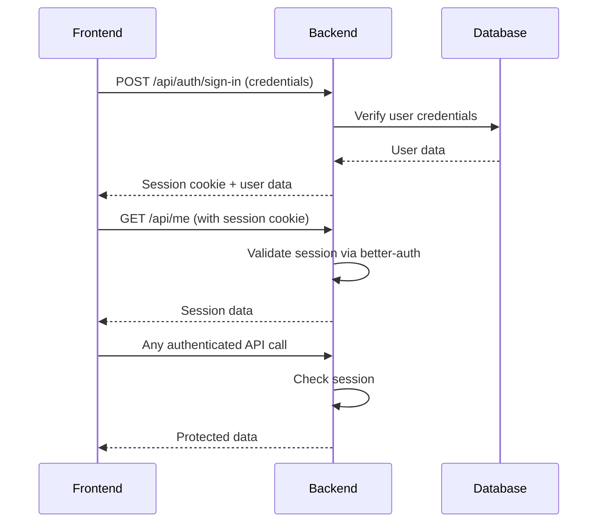

# Integration Architecture

**Generated:** 2025-12-05  
**Repository Type:** Multi-part Application

## Overview

This is a **client-server architecture** where the Vue 3 frontend communicates with the Express backend via REST API. Both parts share the same authentication library (better-auth) for seamless session management.

## Parts Summary

### Backend (API Server)
- **Type:** RESTful API server
- **Tech Stack:** Node.js, Express 5, MySQL, Drizzle ORM
- **Root:** `backend/`
- **Port:** 5001 (default)
- **Purpose:** Data persistence, business logic, authentication

### Frontend (Web Client)
- **Type:** Single Page Application (SPA)
- **Tech Stack:** Vue 3, TypeScript, Vite, TailwindCSS
- **Root:** `frontend/`
- **Port:** 5173 (default, development)
- **Purpose:** User interface, client-side routing, state management

## Integration Points

### 1. Authentication Flow

**Type:** better-auth (Session-based)



**Endpoints:**
- **Backend:** `/api/auth/*` - Handled by better-auth
- **Backend:** `/api/me` - Get current session
- **Frontend:** Uses better-auth client SDK (v1.4.4)

**Data Flow:**
1. User submits credentials in frontend
2. Frontend calls `/api/auth/sign-in`
3. Backend validates via better-auth
4. Backend creates session and returns cookie
5. Frontend stores session in cookies
6. Subsequent requests include session cookie automatically

### 2. API Communication

**Type:** REST API over HTTP

**Protocol:** JSON over HTTP/HTTPS  
**Client:** axios (v1.13.2)  
**Server:** Express (v5.1.0)

**Request Flow:**
```
Frontend (axios)
    ↓ HTTP Request
Backend (Express)
    ↓ Route Handler
Controller
    ↓ Business Logic
Service Layer
    ↓ Database Query
Drizzle ORM → MySQL
```

**Response Flow:**
```
MySQL
    ↓ Query Results
Drizzle ORM
    ↓ Mapped Objects
Service Layer
    ↓ Processed Data
Controller
    ↓ JSON Response
Express → Frontend (axios)
```

### 3. CORS Configuration

**Backend Configuration:** (`backend/src/server.js`)
```javascript
cors({
  origin: process.env.CORS_ORIGIN || "",
  methods: ["GET", "POST", "OPTIONS", "PUT", "DELETE"],
  allowedHeaders: ["Content-Type", "Authorization"],
  credentials: true
})
```

**Allowed Origin:** Configured via `CORS_ORIGIN` environment variable  
**Credentials:** Enabled (for session cookies)  
**Methods:** GET, POST, PUT, DELETE, OPTIONS

### 4. State Management

**Frontend State:** Pinia (v3.0.4)
- Centralized state store
- Reactive data management
- Persists user session state

**Backend State:** Stateless
- Session managed by better-auth (database-backed)
- No in-memory session store

## API Endpoints

### Currently Implemented

| Method | Endpoint | Purpose | Auth Required |
|--------|----------|---------|---------------|
| GET | `/` | Health check | No |
| POST/GET | `/api/auth/*` | Authentication (better-auth) | No |
| GET | `/api/me` | Get current session | Yes |

### Expected Endpoints (Based on Data Models)

| Method | Endpoint | Purpose | Auth Required |
|--------|----------|---------|---------------|
| GET | `/api/tasks` | List tasks | Yes |
| POST | `/api/tasks` | Create task | Yes |
| GET | `/api/tasks/:id` | Get task details | Yes |
| PUT | `/api/tasks/:id` | Update task | Yes |
| DELETE | `/api/tasks/:id` | Delete task | Yes |

> **Note:** Task API endpoints appear to be planned but not yet implemented in routes.

## Data Flow Diagram

```
┌─────────────────────────────────────┐
│         Frontend (Vue 3)            │
│  ┌────────────────────────────┐     │
│  │  Components & Views        │     │
│  └──────────┬─────────────────┘     │
│             │                        │
│  ┌──────────▼─────────────────┐     │
│  │  Services (axios)          │     │
│  └──────────┬─────────────────┘     │
│             │                        │
│  ┌──────────▼─────────────────┐     │
│  │  Pinia Store (State)       │     │
│  └────────────────────────────┘     │
└──────────────┬──────────────────────┘
               │
        HTTP/JSON (REST API)
               │
┌──────────────▼──────────────────────┐
│         Backend (Express)           │
│  ┌────────────────────────────┐     │
│  │  Routes                    │     │
│  └──────────┬─────────────────┘     │
│             │                        │
│  ┌──────────▼─────────────────┐     │
│  │  Controllers               │     │
│  └──────────┬─────────────────┘     │
│             │                        │
│  ┌──────────▼─────────────────┐     │
│  │  Services (Business Logic) │     │
│  └──────────┬─────────────────┘     │
│             │                        │
│  ┌──────────▼─────────────────┐     │
│  │  Drizzle ORM               │     │
│  └──────────┬─────────────────┘     │
└──────────────┬──────────────────────┘
               │
        SQL Queries
               │
┌──────────────▼──────────────────────┐
│         MySQL Database              │
│  ┌────────────────────────────┐     │
│  │  users (better-auth)       │     │
│  │  tasks                     │     │
│  │  todo                      │     │
│  └────────────────────────────┘     │
└─────────────────────────────────────┘
```

## Shared Dependencies

### better-auth Library
- **Backend:** v1.3.34
- **Frontend:** v1.4.4
- **Purpose:** Unified authentication across client and server
- **Strategy:** Server generates sessions, client validates automatically

### Development Tools
- **pnpm:** Package manager for both parts
- **Prettier:** Code formatting (v3.6.2)
- **TypeScript:** Type safety (backend uses `.ts` for certain files)

## Communication Patterns

### Request/Response Cycle
1. Frontend initiates HTTP request via axios
2. Request includes session cookie (if authenticated)
3. Backend validates session via better-auth
4. Backend processes request through controller → service → ORM
5. Backend returns JSON response
6. Frontend updates Pinia store and UI reactively

### Error Handling
- **Backend:** Express error middleware (to be implemented)
- **Frontend:** axios interceptors (to be implemented)
- **Expected:** Consistent error response format

## Environment Configuration

### Backend `.env`
```env
PORT=5001
CORS_ORIGIN=http://localhost:5173
DATABASE_URL=mysql://...
BETTER_AUTH_SECRET=...
```

### Frontend `.env`
```env
VITE_API_URL=http://localhost:5001
```

## Security Considerations

1. **CORS:** Restricted to specific frontend origin
2. **Credentials:** Cookie-based sessions with HttpOnly flag
3. **HTTPS:** Should be used in production
4. **Secrets:** Stored in `.env` files (not committed)
5. **Auth Library:** better-auth handles security best practices

## Deployment Considerations

### Development
- Frontend: `pnpm dev` on port 5173
- Backend: `pnpm dev` on port 5001
- Database: Local MySQL instance

### Production (Recommended)
- Frontend: Static build deployed to CDN/hosting
- Backend: Node.js server on cloud platform
- Database: Managed MySQL service
- Reverse Proxy: Nginx for routing and SSL

## Future Improvements

1. **API Versioning:** `/api/v1/*` for stable contracts
2. **WebSocket:** Real-time updates for task changes
3. **API Documentation:** OpenAPI/Swagger spec
4. **Monorepo:** Combine into pnpm workspace
5. **Shared Types:** TypeScript types package for frontend/backend
6. **GraphQL:** Consider for complex data fetching needs
